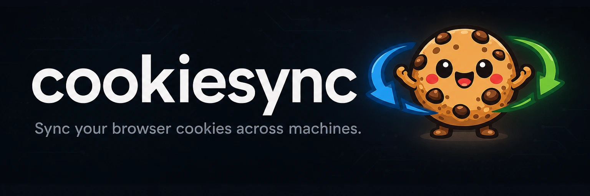
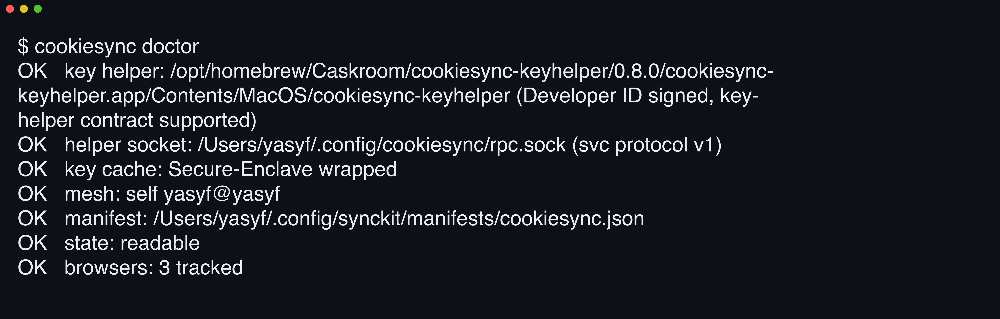

# 

**Your other Mac already did the 2FA.** cookiesync converges browser cookie stores across your Macs over SSH, so the login and 2FA you did at your desk are already live on your laptop.

[](https://github.com/yasyf/cookiesync/actions/workflows/ci.yml)
[](https://github.com/yasyf/cookiesync/releases)
[](LICENSE)

## Get started

```bash
brew install yasyf/tap/cookiesync
cookiesync install
```



Driving with an agent? Paste this:

```text
Install cookiesync: `brew install yasyf/tap/cookiesync`, then run `cookiesync install` and verify with `cookiesync doctor`.
Track my Chrome profile against my other Mac: `cookiesync browser add <host> chrome`.
Prove the sync works by streaming a logged-in session with one Touch ID tap: `cookiesync cookies https://github.com --format header`.
```

---

## Use cases

### Set up a new Mac without re-authenticating anything

A fresh Mac means a day of password resets, 2FA prompts, and SSO dances — for accounts you're already signed into three feet away. Track both Chrome profiles instead:

```bash
cookiesync browser add "$(cookiesync self)" chrome
cookiesync browser add your-desk chrome
```

The next reconcile pass pulls your desk's Chrome store over SSH, merges the two row sets, and writes the union back to both. Open Chrome: GitHub, Gmail, and the SSO portal are already signed in.

### Hand an AI agent your logged-in session, never a password

An agent that needs your GitHub session shouldn't hold your GitHub password. Stream the cookies it needs, on demand:

```bash
cookiesync cookies https://github.com --format header
```

One Touch ID tap approves the requestor, and the command prints a ready-to-paste `Cookie` header — the one output this README deliberately doesn't screenshot. It unions every registered browser and host by default; add `--browser chrome` to pin one. Pass several URLs (an app plus the API host it calls) to get a single Playwright `storageState` spanning them all, off one cached-key decrypt.

### Keep 2FA and SSO logins alive on every machine

Your SSO session expires on whichever Mac you weren't using, so every morning starts with a re-auth somewhere. Check what's tracked:

```bash
cookiesync browser ls
```

```text
yasyf@yasyf-home:chrome:Default
yasyf@yasyf:arc:Default
yasyf@yasyf:chrome:Profile 3
```

Every listed endpoint converges continuously. The daemon watches each cookie store, holds a three-second settle window, then replays the refreshed session tokens onto your other hosts. The morning Okta dance happens once, on whichever Mac you're at.

## How it works

`cookiesync install` notes the signed key helper and registers a manifest with [synckit](https://github.com/yasyf/synckit), the sync substrate cookiesync shares with [reposync](https://github.com/yasyf/reposync). The resident supervisor, `synckitd` (`brew install yasyf/tap/synckitd && synckitd install`), reads that manifest, watches each tracked browser's cookie store, and on a change converges that browser's group across your hosts over SSH: extract on the host that changed, merge the union, re-apply everywhere. Decryption needs the browser's Safe Storage key, which a Developer-ID-signed, notarized helper app releases only behind a Touch ID tap and caches Secure-Enclave-wrapped for a short window.

> **macOS only.** Safe Storage, Touch ID, the Secure Enclave, and launchd don't exist off darwin. Decrypted cookies and keys never land on disk, and you pick exactly which machines and which browser profiles cookiesync touches.

## Commands

| Command | What it does |
| --- | --- |
| `cookiesync` (bare) | Open the TUI: tracked browsers with per-profile presence, plus the host mesh. |
| `install` / `uninstall` | Register (or remove) cookiesync's synckit manifest and note the signed key helper. |
| `doctor` | Check the key helper, resident helper, synckit mesh and manifest, and state. |
| `browser add/ls/rm` | Track, list, and untrack the browser profiles synced across hosts. |
| `browser profiles <browser>` | List this host's profiles for a browser that hold a cookie store. |
| `auth` | Release the Safe Storage key behind one Touch ID tap and cache it for a short window; omit `--browser` to prime every registered browser at once. |
| `cookies <url>...` | Stream cookies for one or more URLs as `playwright`, `netscape`, `header`, or `json`; omit `--browser` to union every registered browser and host. |
| `route-consent <target>` | Route the consent gate to a host that already has a live, unlocked session. |
| `self` | Print this host's SSH target, as the synckit host mesh reports it. |
| `rpc <method>` | Low-level RPC client for the resident daemon (extract, apply, sync, reconcile). |

Run `cookiesync <command> --help` for every flag.

Licensed under [PolyForm Noncommercial 1.0.0](LICENSE).
