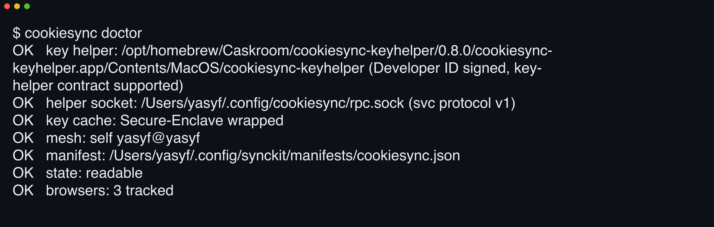

# 

**Your other Mac already did the 2FA.** cookiesync converges browser cookie stores across your Macs over SSH, so the login and 2FA you did at your desk are already live on your laptop.

[](https://github.com/yasyf/cookiesync/actions/workflows/ci.yml)
[](https://github.com/yasyf/cookiesync/releases)
[](LICENSE)

## Get started

```bash
brew install yasyf/tap/cookiesync
cookiesync install
```



Driving with an agent? Paste this:

```text
Install cookiesync: `brew install yasyf/tap/cookiesync`, then run `cookiesync install` and verify with `cookiesync doctor`.
Track my Chrome profile against my other Mac: `cookiesync browser add <host> chrome`.
Prove the sync works by streaming a logged-in session with one Touch ID tap: `cookiesync cookies https://github.com --format header`.
```

---

## Use cases

### Set up a new Mac without re-authenticating anything

A fresh Mac means a day of password resets, 2FA prompts, and SSO dances — for accounts you're already signed into three feet away. Track both Chrome profiles instead:

```bash
cookiesync browser add "$(cookiesync self)" chrome
cookiesync browser add your-desk chrome
```

The next reconcile pass pulls your desk's Chrome store over SSH, merges the two row sets, and writes the union back to both. Open Chrome: GitHub, Gmail, and the SSO portal are already signed in.

### Hand an AI agent your logged-in session, never a password

An agent that needs your GitHub session shouldn't hold your GitHub password. Stream the cookies it needs, on demand:

```bash
cookiesync cookies https://github.com --format header
```

One Touch ID tap approves the requestor, and the command prints a ready-to-paste `Cookie` header — the one output this README deliberately doesn't screenshot. It unions every registered browser and host by default; add `--browser chrome` to pin one. Pass several URLs (an app plus the API host it calls) to get a single Playwright `storageState` spanning them all, off one cached-key decrypt.

### Keep 2FA and SSO logins alive on every machine

Your SSO session expires on whichever Mac you weren't using, so every morning starts with a re-auth somewhere. Check what's tracked:

```bash
cookiesync browser ls
```

```text
yasyf@yasyf-home:chrome:Default
yasyf@yasyf:arc:Default
yasyf@yasyf:chrome:Profile 3
```

Every listed endpoint converges continuously. The daemon watches each cookie store, holds a three-second settle window, then replays the refreshed session tokens onto your other hosts. The morning Okta dance happens once, on whichever Mac you're at.

## How it works

`cookiesync install` notes the signed key helper and registers a manifest with [synckit](https://github.com/yasyf/synckit), the sync substrate cookiesync shares with [reposync](https://github.com/yasyf/reposync). The resident supervisor, `synckitd` (`brew install yasyf/tap/synckitd && synckitd install`), reads that manifest, watches each tracked browser's cookie store, and on a change converges that browser's group across your hosts over SSH: extract on the host that changed, merge the union, re-apply everywhere. Decryption needs the browser's Safe Storage key, which a Developer-ID-signed, notarized helper app releases only behind a Touch ID tap and caches Secure-Enclave-wrapped for a short window.

> **On macOS.** Keychain, Touch ID, the Secure Enclave, and launchd provide key storage, consent, key wrapping, and service management. Decrypted cookies and keys never land on disk, and you pick exactly which machines and which browser profiles cookiesync touches.

## Linux

Linux amd64 is supported on a private single-user VM. Every process running as the same user can control the daemon, so this is not for shared hosts.

Download `cookiesync_linux_amd64.tar.gz` from [releases](https://github.com/yasyf/cookiesync/releases), then extract and install the binary:

```bash
tar -xzf cookiesync_linux_amd64.tar.gz
mkdir -p ~/.local/bin
install -m 0755 cookiesync ~/.local/bin/cookiesync
```

For a new standalone host without peers, create `$XDG_CONFIG_HOME/synckit/state.json`; the default path is `~/.config/synckit/state.json`. Use directory mode `0700` and file mode `0600`. Replace `agent@vm` with this host's `user@host` identity:

```json
{"host_registry":{"self":"agent@vm","hosts":[]},"schema":{"identity":"synckit-state-v1","version":1,"fingerprint":"2dc96a8a0930930535e711cbab04af029573c9b95318206f8a8fbad87677ca38"},"synckit":{}}
```

Run the supervisor in the foreground under the workspace process manager. Its `PATH` must include `~/.local/bin` and provide `cookiesync`, `ssh`, and a Chrome or Chromium binary:

```bash
cookiesync supervise
```

With the supervisor running, initialize and check the helper:

```bash
cookiesync install
cookiesync doctor
```

`install` initializes cookiesync state and starts the resident helper; it writes no synckit manifest. `doctor` checks the supervisor, socket, memory cache, mesh, browser roots, and Chrome binary.

`requestor`, `auth --reason`, `bridge open --json`, and `bridge stop` keep their command contracts. `cookies` supports `playwright`, `webstorage`, `header`, `netscape`, and `json` output. Chrome profiles live under `$XDG_CONFIG_HOME/google-chrome`, defaulting to `~/.config/google-chrome`; Chromium is not registered yet, because the Mac that approves consent must resolve the same browser name. Chromium v10 cookies use a fixed key; v11 uses the Secret Service secret. The bridge runs headless when both `DISPLAY` and `WAYLAND_DISPLAY` are unset.

Linux never approves consent. Local key release routes to an already configured, attended Mac peer or fails closed. Cached keys and grants stay in process memory and expire within five minutes. There is no automatic pairing. If your host has no peers, `auth` fails closed regardless of imports; `cookies` and `bridge open` also fail closed unless a live import names every requested host.

Bring a Mac's cookies for a few hosts onto your VM without giving the VM a key.

```bash
cookiesync cookies --browser chrome --profile Default --format playwright -- app.example.com api.example.com | ssh vm cookiesync import --ttl 1h --format playwright --browser chrome --profile Default -- app.example.com api.example.com
```

The helper holds your import only in memory, bound to the browser, profile, named hosts, and `--ttl`. The minimum `--ttl` is `1s` and the maximum is `24h`. Reads refuse your import at expiry. The helper's reaper runs every 30 s and purges expired imports. A helper restart or upgrade drops it. A new import for the same browser and profile replaces it. The helper refuses your import unless the hosts you name and the origins in your document are plain ASCII hosts or origins without a user name, path, query, or fragment.

`cookies`, with or without `--browser`, and `bridge open` serve your import while every requested host is a named host. One host your import does not name sends the whole request through the normal path, which fails closed on a standalone VM. A native profile, when present, serves every host in that request, including hosts your import names, under the normal consent rules.

The helper refuses your whole import if a cookie or origin reaches past the named hosts. You can send up to `16 MiB` encoded in one request.

`playwright` carries cookies and `localStorage`, while `webstorage` carries `localStorage` and `sessionStorage` with no cookies. You get `sessionStorage` only from a `webstorage` import.

Your imported browser and profile are opaque labels that select the import record in the helper's memory and are never used as a file system path. You need no local profile for any imported browser and profile. On a host with no Chrome profile or native cookie store, you can run `import`, `cookies` with or without `--browser`, and `bridge open`. The import path never reads a native browser profile, cookiesync's browser state, the key cache, or a key ring. When you run `bridge open` from an import, the import path asks the broker only for the bridge lease length, never for a key or consent, and creates no profile. Every `bridge open` still reads the synckit host registry, the mesh state file, to resolve your target host.

A `bridge open` seeded from your import gets a lease no longer than the import's remaining TTL. The bridge closes when that lease expires.

TTL expiry does not revoke cookies already returned by `cookies`, stored by your agent, or seeded into a bridge's Chrome. Each receiving process keeps its copy until it exits. TTL limits how long the helper serves your record, not the life of copies it hands out.

## Commands

| Command | What it does |
| --- | --- |
| `cookiesync` (bare) | Open the TUI: tracked browsers with per-profile presence, plus the host mesh. |
| `install` / `uninstall` | Register (or remove) cookiesync's synckit manifest and note the signed key helper. |
| `doctor` | Check the key helper, resident helper, synckit mesh and manifest, and state. |
| `browser add/ls/rm` | Track, list, and untrack the browser profiles synced across hosts. |
| `browser profiles <browser>` | List this host's profiles for a browser that hold a cookie store. |
| `auth` | Release the Safe Storage key behind one Touch ID tap and cache it for a short window; omit `--browser` to prime every registered browser at once. `--wait <d>` holds until a Mac with a live session can approve, then prompts once; a denial exits 3 and a timeout exits 4. |
| `cookies <url>...` | Stream cookies for one or more URLs as `playwright`, `netscape`, `header`, `json`, or `webstorage`; omit `--browser` to union every registered browser and host. |
| `import --ttl <d> --format <f> --browser <b> --profile <p> -- <host>...` | Linux only. Hold a Mac-exported cookies or web-storage document in memory for the named hosts until the TTL lapses. |
| `route-consent <target>` | Route the consent gate to a host that already has a live, unlocked session. |
| `self` | Print this host's SSH target, as the synckit host mesh reports it. |
| `rpc <method>` | Low-level RPC client for the resident daemon (extract, apply, sync, reconcile). |

Run `cookiesync <command> --help` for every flag.

Licensed under [PolyForm Noncommercial 1.0.0](LICENSE).
